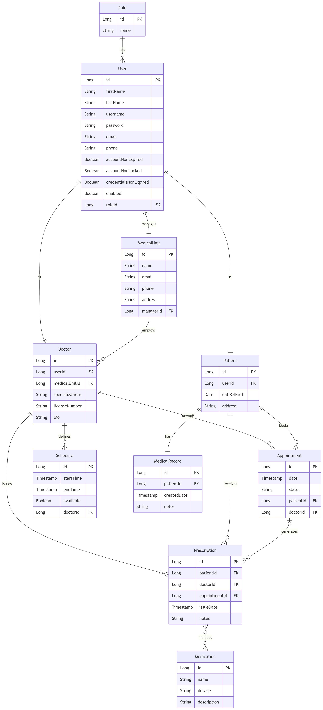

# MedicalPlatform ~ Medical Appointments & Records System
## Business Requirements and MVP Features

### I. Business Domain Overview

MedicalPlatform is designed to connect **patients** with **doctors** working under
**medical units** through a digital healthcare management system.
An **Admin** onboards medical units onto the platform; each **MedicalUnit** is run by its own
manager, who in turn registers and manages the doctors working under that medical unit,
together with their specializations. Patients can browse medical units and doctors, book
appointments, and interact with the medical staff who maintain their medical records,
issue digital prescriptions and track medication/treatment history.  The Monolithic backend 
is powered by Java Spring Boot, with a relational database to store all persistent data, 
while the frontend uses simple Thymeleaf views.
Access is role-based, distinguishing between **Patient**, **Doctor**, **Medical Unit
Manager** and **Admin** users.

### II. Business Requirements

| Nr. | Requirement | Description |
| --: | ----------- | ----------- |
|  1. | Role-Based Access Control | The system must implement role-based access control, distinguishing between Patient, Doctor, Medical Unit Manager and Admin users. |
|  2. | Medical Unit Registration | Admins must be able to register new medical units, providing their name, contact information and address. |
|  3. | Doctor Management by Medical Unit | Medical unit managers must be able to add, update, and remove the doctors working under their medical unit, and manage the specializations associated with each doctor. |
|  4. | Patient Registration | Patients must be able to register their details (first name, last name, contact information) to use the platform. |
|  5. | Appointment Booking | Patients must be able to book, view and cancel online appointments with a doctor, based on that doctor's availability. |
|  6. | Doctor Schedule Management | Doctors must be able to manage their appointments and define their available time slots. |
|  7. | Medical Records Management | The system must allow doctors to create and update patients' medical records. |
|  8. | Digital Prescriptions | Doctors must be able to issue digital medical prescriptions to patients. |
|  9. | Medication & Treatment History | The system must allow managing the history of medications and treatments prescribed to patients. |
| 10. | Consultation History | The system must allow generating the consultation and treatment history for each patient. |
| 11. | Doctor Search | Patients must be able to search for doctors by name, specialization, medical unit and availability. |
| 12. | Admin Dashboard | The system must allow an administrator to overview the platform's current status (total medical units, doctors, patients, appointments). |

### III. Features
### Feature 1 ~ Medical Unit Management

**Requirements:** 1. & 2. \
**Description:** Admins can register, update and remove medical units on the platform. Each medical unit is assigned a manager, who is responsible for that medical unit's doctors. \
**Actions:**
* Register a new medical unit. (**POST** /api/medicalUnits)
* Delete a registered medical unit. (**DELETE** /api/medicalUnits/{id})
* Update a registered medical unit. (**PUT** /api/medicalUnits/{id})
* Get a list of all medical units with possible filtering. (**GET** /api/medicalUnits)
* Get a particular medical unit. (**GET** /api/medicalUnits/{id})
* Get a particular medical unit by its manager. (**GET** /api/medicalUnits/by-manager/{manager})
* Filter by location, name, paging & sorting.

### Feature 2 ~ Doctor Management

**Requirements:** 1. & 3. \
**Description:** Medical unit managers can add, update, remove doctors working under their medical unit, and manage the specializations associated with each doctor. \
**Actions:**
* Add a new doctor to a medical unit. (**POST** /api/medicalUnits/{id}/doctors)
* Delete a registered doctor. (**DELETE** /api/doctors/{id})
* Update a registered doctor. (**PUT** /api/doctors/{id})
* Get a list of all doctors with possible filtering. (**GET** /api/doctors)
* Get a particular doctor. (**GET** /api/doctors/{id})
* Get a list of a particular medical unit's doctors. (**GET** /api/medicalUnits/{id}/doctors)
* Add/remove a specialization for a doctor. (**POST**/**DELETE** /api/doctors/{id}/specializations/{specId})
* Search doctors by name, specialization, medical unit or availability. (**GET** /api/doctors/search)
* Filter by name, specialization, medical unit id.

### Feature 3 ~ Patient Management

**Requirements:** 1. & 4. \
**Description:** Patients can register and manage their personal details. \
**Actions:**
* Register a new patient. (**POST** /api/patients)
* Delete a registered patient. (**DELETE** /api/patients/{id})
* Update a registered patient. (**PUT** /api/patients/{id})
* Get a list of all patients with possible filtering. (**GET** /api/patients)
* Get a particular patient. (**GET** /api/patients/{id})
* Filter by first name and last name.

### Feature 4 ~ Appointment Management

**Requirements:** 5. & 6. \
**Description:** Patients can book appointments with a doctor according to available time slots. Doctors and patients can view, cancel or update the status of an appointment. \
**Actions:**
* Book an appointment. (**POST** /api/appointments/for-patient/{patientId}/with-doctor/{doctorId})
* Delete/cancel an appointment. (**DELETE** /api/appointments/{id})
* Update an appointment's date and status (Done or Cancelled). (**PUT** /api/appointments/{id})
* Get a particular appointment. (**GET** /api/appointments/{id})
* Get a list of all appointments with possible filtering. (**GET** /api/appointments)
* Get a doctor's appointments. (**GET** /api/doctors/{id}/appointments)
* Get a patient's appointments. (**GET** /api/patients/{id}/appointments)
* Filter by patient id, doctor id, status and date range.

### Feature 5 ~ Doctor Schedule Management

**Requirements:** 6. \
**Description:** Doctors can define and manage the time slots in which they are available for consultations, avoiding overlapping appointments. \
**Actions:**
* Add an available time slot. (**POST** /api/schedules/for-doctor/{doctorId})
* Delete a time slot. (**DELETE** /api/schedules/{id})
* Update a time slot. (**PUT** /api/schedules/{id})
* Get a doctor's schedule. (**GET** /api/schedules/by-doctor/{doctorId})
* Get available slots for a doctor within a date range. (**GET** /api/schedules/by-doctor/{doctorId}/available)

### Feature 6 ~ Medical Records Management

**Requirements:** 7. & 10. \
**Description:** Each patient has a central medical record maintained by their treating doctors, containing consultation and treatment history. \
**Actions:**
* Create a medical record for a patient. (**POST** /api/medical-records/for-patient/{patientId})
* Update a medical record. (**PUT** /api/medical-records/{id})
* Get a particular medical record. (**GET** /api/medical-records/{id})
* Get a patient's medical record. (**GET** /api/medical-records/by-patient/{patientId})
* Get a patient's consultation/treatment history. (**GET** /api/medical-records/by-patient/{patientId}/history)

### Feature 7 ~ Prescription Management

**Requirements:** 8. \
**Description:** Doctors can issue digital prescriptions linked to a patient and, optionally, to a specific appointment. \
**Actions:**
* Issue a prescription. (**POST** /api/prescriptions/for-patient/{patientId}/by-doctor/{doctorId})
* Delete a prescription. (**DELETE** /api/prescriptions/{id})
* Update a prescription. (**PUT** /api/prescriptions/{id})
* Get a particular prescription. (**GET** /api/prescriptions/{id})
* Get a list of all prescriptions with possible filtering. (**GET** /api/prescriptions)
* Get a patient's prescriptions. (**GET** /api/prescriptions/by-patient/{patientId})
* Filter by patient id, doctor id, date range.

### Feature 8 ~ Medication & Treatment History

**Requirements:** 9. \
**Description:** The system manages the medications attached to prescriptions and keeps a history of treatments per patient, reducing the risk of wrong or duplicate prescriptions. \
**Actions:**
* Add a medication to a prescription. (**POST** /api/prescriptions/{id}/medications/{medicationId})
* Remove a medication from a prescription. (**DELETE** /api/prescriptions/{id}/medications/{medicationId})
* Get a list of all medications with possible filtering. (**GET** /api/medications)
* Get a particular medication. (**GET** /api/medications/{id})
* Get a patient's medication/treatment history. (**GET** /api/medications/by-patient/{patientId}/history)
* Filter by name, patient id.

### Feature 9 ~ Admin Dashboard

**Requirements:** 1. & 12. \
**Description:** The administrator can view a summary of the platform's activity (total medical units, doctors, patients, appointments and prescriptions). \
**Actions:**
* Get the overview statistics. (**GET** /api/admin/stats)

### IV. Entities


There are 10 entities:

* User
* Role
* MedicalUnit
* Doctor
* Patient
* Appointment
* Schedule
* MedicalRecord
* Prescription
* Medication

with the following relationships:

* 2 Many to Many —  **Prescription ↔ Medication** (a prescription can include several medications, a medication can appear on several prescriptions), **Role ↔ User**
* 4 One to One — **User ↔ MedicalUnit** (a medical unit is run by exactly one manager user), **User ↔ Doctor** (a doctor account maps to exactly one user login), **User ↔ Patient** (a patient account maps to exactly one user login), **Patient ↔ MedicalRecord** (each patient has exactly one central medical record).
* 4 One to Many / Many to One — **MedicalUnit → Doctor** (a medical unit employs several doctors), **Doctor → Appointment**, **Patient → Appointment**, **Doctor → Prescription**.

### V. Architecture

MedicalPlatform is a Spring Boot REST API application for managing medical units, doctors,
patients, appointments, medical records and prescriptions.

### Overview

The application follows a layered architecture:

Client (Browser) &mdash; Thymeleaf Views &mdash; Controllers (Spring MVC) &mdash; Services (Business Logic) &mdash; Repositories (Spring Data JPA) &mdash; Database (MySQL or H2)

### VI. Setup
### IDE (Build System)

Preferably IntelliJ with Maven & JDK 21.

### Additional Tools

Docker (Desktop or CLI + Compose), for running the database container.

### Instructions

* Create a `.env` file following the example one, with the required database variables.
* Start every container. For medicalplatform container:
```bash
docker compose -f docker-compose.yml up -d
```
* Open the project in an IDE or build it with Maven (clean + package).
* Run the application from the IDE or directly using a Java Runtime.
* The API should be available locally now (default: `http://localhost:8080`).